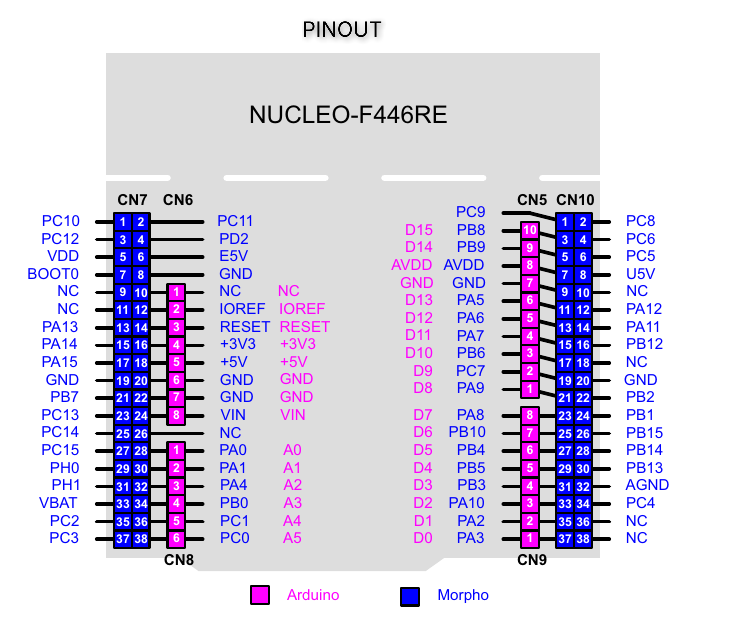

# stm32-baremetal

Adding codes that I use while learning Bare-Metal programming on the STM32

## Board used
- STM32 NUCLEO-F446RE
    
- [Datasheet](https://www.st.com/resource/en/datasheet/stm32f446mc.pdf)
- [Reference Manual](https://www.st.com/resource/en/reference_manual/rm0390-stm32f446xx-advanced-armbased-32bit-mcus-stmicroelectronics.pdf)
- [User Manual](https://www.st.com/resource/en/user_manual/um1724-stm32-nucleo64-boards-mb1136-stmicroelectronics.pdf) 

